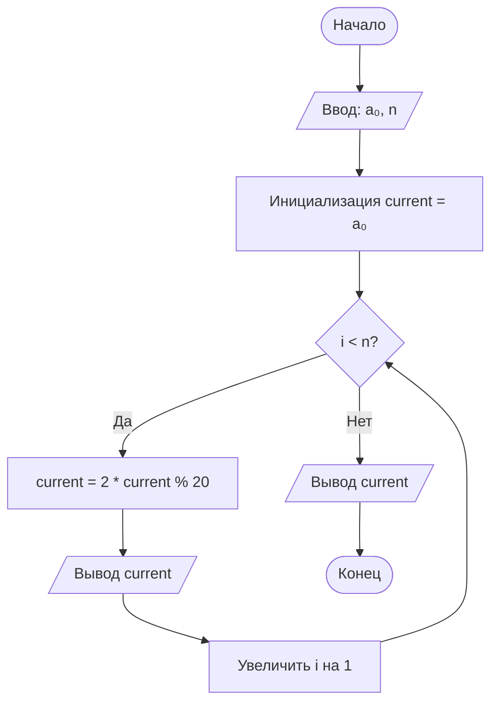

#### Отчет по лабораторной работе № 2

#### № группы: ПМ-2501

#### Выполнила: Бизина Юлиана Кирилловна

#### Вариант: 2

### Cодержание:

Задание 1
- Постановка задачи
- Входные и выходные данные
- Выбор структуры данных
- Алгоритм
- Программа
- Анализ правильности решения
  
Задание 2
- Постановка задачи
- Входные и выходные данные
- Выбор структуры данных
- Алгоритм
- Программа
- Анализ правильности решения
  
-Задание 3
- Постановка задачи
- Входные и выходные данные
- Выбор структуры данных
- Алгоритм
- Программа
- Анализ правильности решения

Задание 4
- Постановка задачи
- Входные и выходные данные
- Выбор структуры данных
- Алгоритм
- Программа
- Анализ правильности решения

### Задание 1

### 1. Постановка задачи
>Необходимо было проанализировать последовательность, генерируемую по определенному правилу, выявить закономерность генераций данной последовательности при вводе конкретных чисел и запрограммировать ее. Последовательность строится по формуле, где каждый следующий элемент зависит от предыдущего.

### 2. Входные и выходные данные

#### Данные на вход

На вход программа должна получать 2 числа: a0 - нулевой член последовательности, по условию - целое число, и n - количество членов последовательности после нулевого элемента, по условию - натуральное число.

|             | Тип                |
|-------------|--------------------|
| a0          | Целое число        |
| n           | Целое число        |

#### Данные на выход

Программа должна вывести последовательность из n чисел.

|    Результат         | Тип             |
|----------------------|-----------------|
| Последовательность   | Массив          |

### 3. Выбор структуры данных
В задаче не дано условие множества значений целых чисел, поэтому выберем тип данных `int`, как оптимальный для данной программы, ведь int вмещает в себя числа от - 2³¹ до 2³¹, что вполне достаточно для данной программы, в отличие от `byte` или `short` со слишком небольшими диапазонами значений, а тип данных `long` занимает больше памяти и используется с большими значениями, что не является обязательным условием для нашей задачи. Программа получает 2 целых числа, поэтому для их хранения можно выделить 2 переменных (`a0` и `n`) типа `int`. 

|             | Название переменной | Тип (в Java) |   Диапазон    |
|-------------|---------------------|--------------|---------------|
| A           | a                   |   int        | -2³¹ до 2³¹-1 |
| N           | n                   |   int        | -2³¹ до 2³¹-1 |

Для вывода результата необязательно его хранить в отдельной переменной для массива, достаточно с каждой итерацией цикла for выводить получившееся число.

### 4. Алгоритм

#### Алгоритм выполнения программы:

Выявленная закономерность:
Перед началом работы с программой необходимо было выявить закономерность в последовательности. После анализа примеров понятно, что последовательность генерируется по формуле:
a{n+1} = (2 × a{n}) mod 20

1. Ввод данных:  
   Программа считывает два целых числа, обозначенные как a0 и n.

2. Инициализация переменной:
   Вводится переменная current, которой изначально присваивается значение a0. Переменная типа `long`, чтобы в случае умножения большого числа на 2 не выйти за предел диапазона типа `int`.

3. Генерация последовательности и вывод:
   Для каждого i от 0 до n-1 вычисляется и выводится на экран current = (current * 2) % 20

#### Блок-схема



### 5. Программа

```java
import java.util.Scanner;
public class Main {
    public static void main(String[] args) {
        Scanner scanner = new Scanner(System.in);
        System.out.print("Введите нулевой член последовательности: ");
        int a0 = scanner.nextInt();
        System.out.print("Введите длину последовательности: ");
        int n = scanner.nextInt();
        int current = a0;
        for (int i = 0; i < n; i++) {
            current = (int)((long)current * 2 % 20);
            System.out.print(current);
            if (i < n - 1) {
                System.out.print(", ");
            }
        }
    }
}

```
### 6. Анализ правильности решения

Программа работает корректно на тестовых примерах с учетом ограничений.

1.
    - **Input**:
        
        12 4
        
    - **Output**:
        
        4, 8, 16, 12

    - **Ожидаемый результат: 4, 8, 16, 12**

2.
    - **Input**:
        
        10 3
        
    - **Output**:
        
        0, 0, 0

    - **Ожидаемый результат: 0, 0, 0**

2.
    - **Input**:
        
        3 5
        
    - **Output**:
        
        6, 12, 4, 8, 16

    - **Ожидаемый результат: 6, 12, 4, 8, 16**
  
### Задание 2

### 1. Постановка задачи
>Необходимо найти в массиве позицию, на которой максимальный элемент встречается k-ый раз. Если максимальный элемент встречается меньше k раз, вывести "NO".

### 2. Входные и выходные данные

#### Данные на вход

На вход программа получает число n - размер массива, число k - порядковый номер вхождения максимума, и n целых чисел - элементы массива, n и k - целые числа, arr[i] - n целых чисел.

|             | Тип                |
|-------------|--------------------|
| n           | Целое число        |
| k           | Целое число        |
| arr[i]      | Целое число        |

#### Данные на выход

Программа должна вывести позицию k-го вхождения максимума или "NO".

|    Результат       |        Тип          |
|--------------------|---------------------|
| Позиция или "NO"   | Целое число/строка  |

### 3. Выбор структуры данных
В задаче не дано условие множества значений целых чисел, поэтому выберем тип данных int, как оптимальный для данной программы, ведь int вмещает в себя числа от -2³¹ до 2³¹-1, что вполне достаточно для данной программы, в отличие от byte или short со слишком небольшими диапазонами значений, а тип данных long занимает больше памяти и используется с большими значениями, что не является обязательным условием для нашей задачи. Программа получает n+1 целых чисел (n и n элементов массива), поэтому для их хранения можно выделить переменные типа int.

|             | Название переменной | Тип (в Java) |   Диапазон    |
|-------------|---------------------|--------------|---------------|
| N           | n                   |   int        | -2³¹ до 2³¹-1 |
| K           | k                   |   int        | -2³¹ до 2³¹-1 |
| ARR         | arr                 |   int        | -2³¹ до 2³¹-1 |
| MAX         | max                 |   int        | -2³¹ до 2³¹-1 |
| CNT         | cnt                 |   int        | -2³¹ до 2³¹-1 |
| RES         | res                 |   int        | -2³¹ до 2³¹-1 |

### 4. Алгоритм

#### Алгоритм выполнения программы:

1. Ввод данных:  
   Читаем n и k. Читаем n чисел в массив arr.
   
2. Поиск максимума:
   Проходим по массиву и находим максимальный элемент

3. Поиск k-го вхождения:
   Проходим по массиву второй раз. Для каждого элемента равного максимуму увеличиваем счетчик. Когда счетчик достигает k, сохраняем позицию

4. Вывод результата:
   Если нашли k-ое вхождение - выводим позицию. Иначе - выводим "NO"

### 5. Программа

```java
import java.util.Scanner;
public class Main2 {
    public static void main(String[] args) {
        Scanner scanner = new Scanner(System.in);
        int n = scanner.nextInt();
        int k = scanner.nextInt();
        int[] arr = new int[n];
        int max = -1000000000;
        for (int i = 0; i < n; i++) {
            arr[i] = scanner.nextInt();
            if (arr[i] > max) {
                max = arr[i];
            }
        }
        int cnt = 0;
        int res = -1;
        for (int i = 0; i < n; i++) {
            if (arr[i] == max) {
                cnt++;
                if (cnt == k) {
                    res = (int) (i + 1);
                }
            }
        }
        if (res >= 0) {
            System.out.println(res);
        } else {
            System.out.println("NO");
        }
    }
}

```

### 6. Анализ правильности решения

Программа работает корректно на тестовых примерах с учетом ограничений.

1.
    - **Input**:
        
        6 2
        1 5 3 5 2 5
        
    - **Output**:
        
        4

    - **Ожидаемый результат: 4**

2.
    - **Input**:
        
        5 3
        1 2 3 2 1
        
    - **Output**:
        
        NO

    - **Ожидаемый результат: NO**

3.
    - **Input**:
        
        4 1
        10 20 30 40
        
    - **Output**:
        
        4

    - **Ожидаемый результат: 4**

### Задание 3

### 1. Постановка задачи
>Необходимо определить, является ли введенная строка правильной скобочной последовательностью. В правильной последовательности каждая открывающая скобка имеет соответствующую закрывающую, и закрывающие скобки не встречаются раньше открывающих.

Данные на выход
Программа должна вывести "YES" или "NO".

### 2. Входные и выходные данные

#### Данные на вход

На вход программа получает строку, содержащую только символы '(' и ')'.

|             | Тип                |
|-------------|--------------------|
| s           | Строка             |

#### Данные на выход

Программа должна вывести "YES" или "NO".

|    Результат      |      Тип      |
|-------------------|---------------|
| "YES" или "NO"    | Cтрока        |

### 3. Выбор структуры данных
В задаче на вход подается строка, поэтому тип данных - String.

|             | Название переменной | Тип (в Java) |   Диапазон    |
|-------------|---------------------|--------------|---------------|
| S           | s                   |   String     |               |
| CNT         | cnt                 |   int        | -2³¹ до 2³¹-1 |
| STAPLES     | staples             |   boolean    |  true/false   |

### 4. Алгоритм

#### Алгоритм выполнения программы:

1. Ввод данных:
   Читаем строку s
   
2. Инициализация:
   cnt = 0 (баланс скобок)
   staples = true (изначально считаем последовательность правильной)

3. Проверка последовательности:
   Для каждого символа в строке:
    Если '(' → увеличиваем cnt
    Если ')' → уменьшаем cnt
    Если cnt < 0 → устанавливаем staples = false и выходим из цикла

4. Финальная проверка и вывод:
   Если staples = true и cnt = 0 → "YES"
   Иначе → "NO"
   
### 5. Программа

```java
import java.util.Scanner;
public class Main3 {
    public static void main(String[] args) {
        Scanner scanner = new Scanner(System.in);
        String s = scanner.nextLine();
        int cnt = 0;    
        boolean staples = true;
        for (int i = 0; i < s.length(); i++) {
            char c = s.charAt(i);
            if (c == '(') {
                cnt++;
            } else if (c == ')') {
                cnt--;
            }
            if (cnt < 0) {
                staples = false;
                break;
            }
        }
        if (staples && cnt == 0) {
            System.out.println("YES");
        } else {
            System.out.println("NO");
        }
    }
}

```

### 6. Анализ правильности решения

Программа работает корректно на тестовых примерах с учетом ограничений.

1.
    - **Input**:
        
       "(()())"
        
    - **Output**:
        
        YES

    - **Ожидаемый результат: YES**

2.
    - **Input**:
        
        "())("
        
    - **Output**:
        
        NO

    - **Ожидаемый результат: NO**

3.
    - **Input**:
        
        "(()"
        
    - **Output**:
        
        NO

    - **Ожидаемый результат: NO**
  
### Задание 4

### 1. Постановка задачи
>Необходимо найти в массиве элемент, значение которого равно удвоенному количеству его вхождений в массиве. Если такого элемента нет, вывести "NO".

### 2. Входные и выходные данные

#### Данные на вход

На вход программа получает число n - размер массива, и n целых чисел - элементы массива.

|             | Тип                |
|-------------|--------------------|
| n           | Целое число        |
| arr         | Массив целых чисел |

#### Данные на выход

Программа должна вывести значение найденного элемента или "NO".

|    Результат      |      Тип              |
|-------------------|-----------------------|
| Число или "NO"    | Целое число/строка    |

### 3. Выбор структуры данных
В задаче не дано условие множества значений целых чисел, поэтому выберем тип данных int, как оптимальный для данной программы, ведь int вмещает в себя числа от -2³¹ до 2³¹-1, что вполне достаточно для данной программы, в отличие от byte или short со слишком небольшими диапазонами значений, а тип данных long занимает больше памяти и используется с большими значениями, что не является обязательным условием для нашей задачи. Программа получает n+1 целых чисел (n и n элементов массива), поэтому для их хранения можно выделить переменные типа int.

|             | Название переменной | Тип (в Java) |   Диапазон    |
|-------------|---------------------|--------------|---------------|
| N           | n                   |   int        | -2³¹ до 2³¹-1 |
| ARR         | arr	                |   int[]      | -2³¹ до 2³¹-1 |
| DIGIT       | digit               |   boolean    |  true/false   |
| RES         | res                 |   int        | -2³¹ до 2³¹-1 |

### 4. Алгоритм

#### Алгоритм выполнения программы:

1. Ввод данных:
   Читаем n. Читаем n чисел в массив arr
   
2. Поиск элемента:
   Для каждого элемента arr[i]:
     Считаем сколько раз он встречается в массиве
     Проверяем условие: arr[i] == 2 × count
       Если условие выполняется и это первый подходящий элемент, сохраняем его

3. Вывод результата:
   Если нашли элемент → выводим его значение
   Иначе → выводим "NO"
   
### 5. Программа

```java
import java.util.Scanner;
public class Main4 {
    public static void main(String[] args) {
        Scanner scanner = new Scanner(System.in);
        int n = scanner.nextInt();
        int[] arr = new int[n];
        for (int i = 0; i < n; i++) {
            arr[i] = scanner.nextInt();
        }
        boolean digit = false;
        int res = 0;
        for (int i = 0; i < n; i++) {
            int count = 0;
            for (int j = 0; j < n; j++) {
                if (arr[j] == arr[i]) {
                    count++;
                }
            }
            if (arr[i] == 2 * count) {
                if (!digit){
                    digit = true;
                    res = arr[i];
                }
            }
        }
        if (digit){
            System.out.println(res);
        }else{
            System.out.println("NO");
        }
    }
}

```

### 6. Анализ правильности решения

Программа работает корректно на тестовых примерах с учетом ограничений.

1.
    - **Input**:
        
        4
        4 2 4 4
        
    - **Output**:
        
        2

    - **Ожидаемый результат: 2**

2.
    - **Input**:
        
        5
        4 2 3 2 1
        
    - **Output**:
        
        NO

    - **Ожидаемый результат: NO**

3.
    - **Input**:
        
        6
        6 3 4 3 4 4
        
    - **Output**:
        
        NO

    - **Ожидаемый результат: NO**
